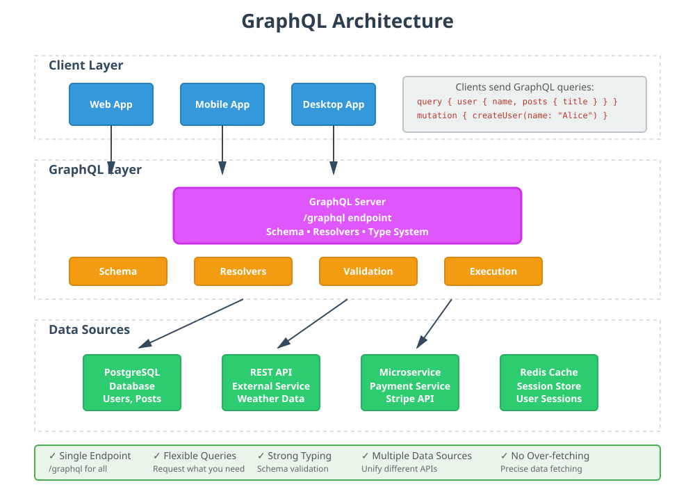
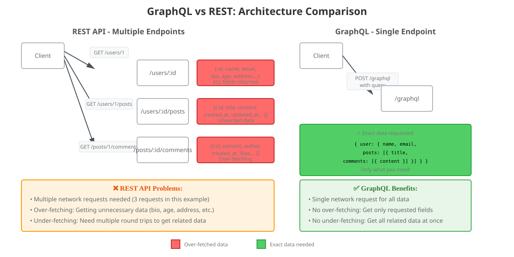

# GraphQL vs REST: Complete Tutorial with Ruby Examples

This repository contains a comprehensive tutorial on GraphQL with practical Ruby on Rails examples and comparisons with REST API.

## 📚 What's Inside

- Complete GraphQL explanation
- REST vs GraphQL comparison with real examples
- Ruby on Rails implementation guide
- Best practices and common patterns
- Real-world code examples

## 🚀 Quick Start

Read the full tutorial: [GraphQL-Tutorial.md](./GraphQL-Tutorial.md)

## 📊 Visual Guides

### GraphQL Architecture


GraphQL uses a single endpoint and a type system to define your API, allowing clients to request exactly the data they need. All clients (web, mobile, desktop) communicate with a single GraphQL server that can fetch data from multiple sources.

### GraphQL vs REST Comparison


**Key Differences:**
- **REST**: Multiple endpoints, potential over-fetching/under-fetching, multiple requests
- **GraphQL**: Single endpoint, precise data fetching, one request for all data

## 🎯 Key Concepts Covered

1. **What is GraphQL?**
   - Query language for APIs
   - Runtime for executing queries
   - Strongly typed schema

2. **GraphQL vs REST**
   - Endpoint structure differences
   - Data fetching strategies
   - Pros and cons of each approach

3. **Core Components**
   - Schema & Types
   - Queries (Read)
   - Mutations (Write)
   - Subscriptions (Real-time)

4. **Ruby Implementation**
   - Setting up GraphQL in Rails
   - Defining types and resolvers
   - Authentication & authorization
   - N+1 query prevention

## 💡 Code Examples

### Simple Query Example

```graphql
query {
  user(id: 1) {
    name
    email
    posts {
      title
      comments {
        content
      }
    }
  }
}
```

### Mutation Example

```graphql
mutation {
  createPost(
    title: "GraphQL Tutorial"
    content: "Learning GraphQL..."
  ) {
    post {
      id
      title
    }
    errors
  }
}
```

## 🛠️ Setup Instructions

1. Add to your Gemfile:
```ruby
gem 'graphql'
gem 'graphiql-rails'
```

2. Install:
```bash
bundle install
rails generate graphql:install
```

3. Start exploring GraphQL at `http://localhost:3000/graphiql`

## 📖 Additional Resources

- [Official GraphQL Documentation](https://graphql.org)
- [GraphQL Ruby Gem](https://graphql-ruby.org)
- [How to GraphQL](https://www.howtographql.com)

## 🤝 Contributing

Feel free to submit issues or pull requests to improve this tutorial!

## 📝 License

This tutorial is open source and available for educational purposes.

---

**Made with ❤️ for the developer community**
